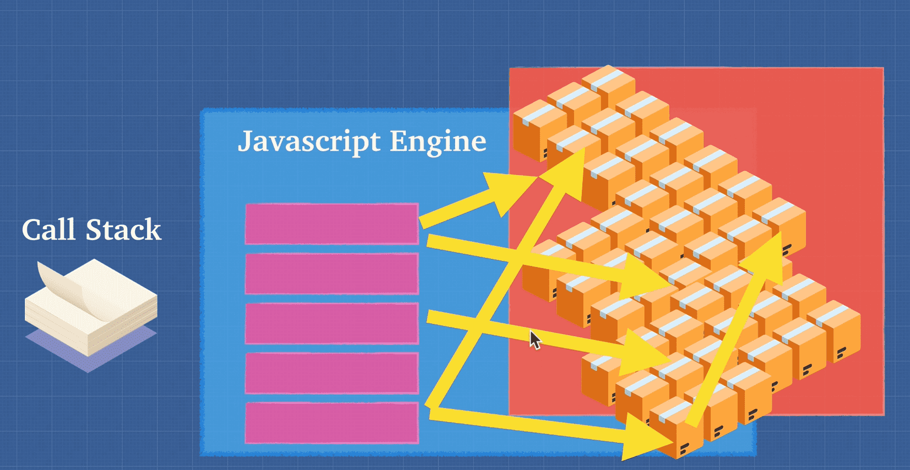
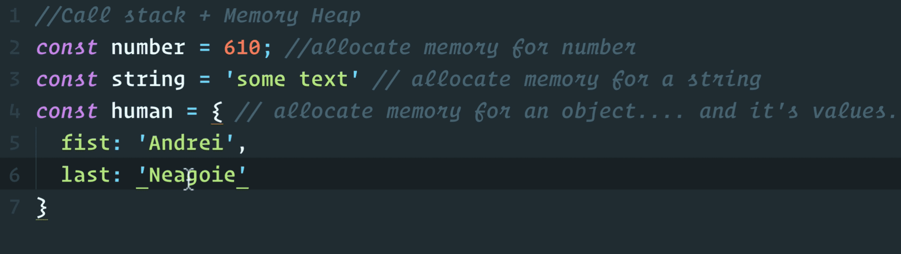
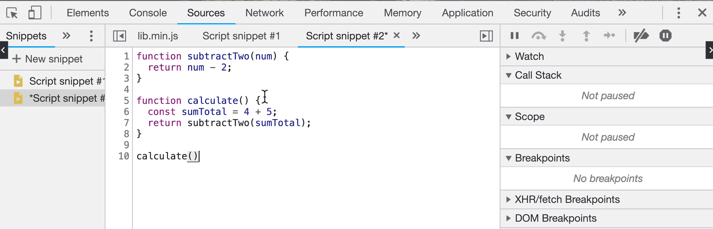
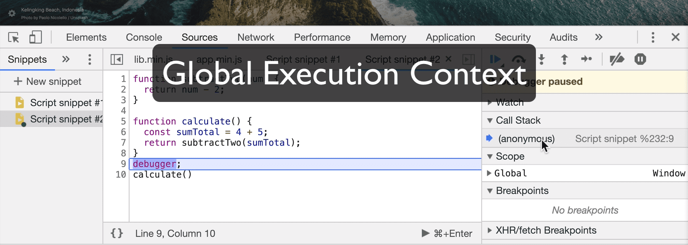
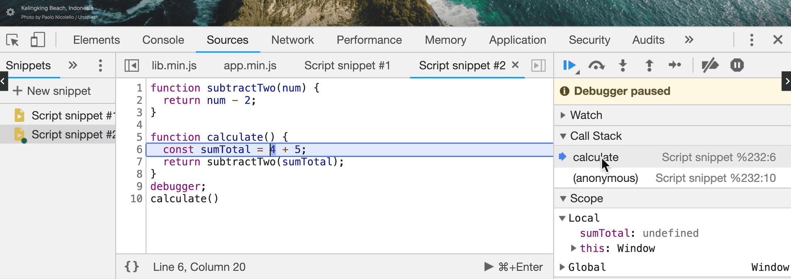
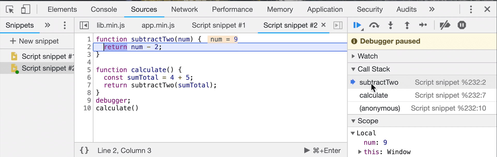
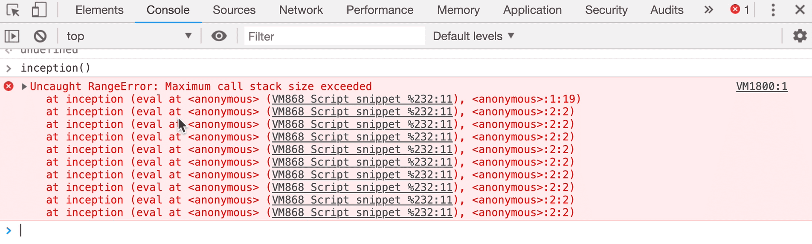

### 2. Call Stack and Memory Heap

#### <ins>Call stack:</ins>

- Place to <ins>**keep track of where we are in the code**</ins> so that we can run the code in order.
- Call Stack operates in **LIFO Mode (Last In First Out)**
- Call Stack <ins>stores functions and variables as your code executes at each entry</ins> of the stack helps us to know where we are in the code

#### <ins>Memory Heap:</ins>

- We need memory heap <ins>**as a place to store and write information**</ins>.
- That is the reason we have a place for allocating memory, use memory and release memory.
- <ins>There is no order in storing data.</ins>

##### <ins>Animation:</ins>

##### <ins>Example Scenario:</ins>

##### <ins>Following shows us how Call Stack work behind the scenes:</ins>

<ins>Below is the code:</ins>

**Global Execution Context**: (anonymous)

**After calculate() function is invoked**, it is added to the top of the Call Stack

**After subtractTwo() function is invoked**, it is added to the top of the call stack

**Note:** <ins>**_We can get Maximum call stack size exceeded_**</ins> in one of the scenarios like **Recursion** which means a function calling itself

