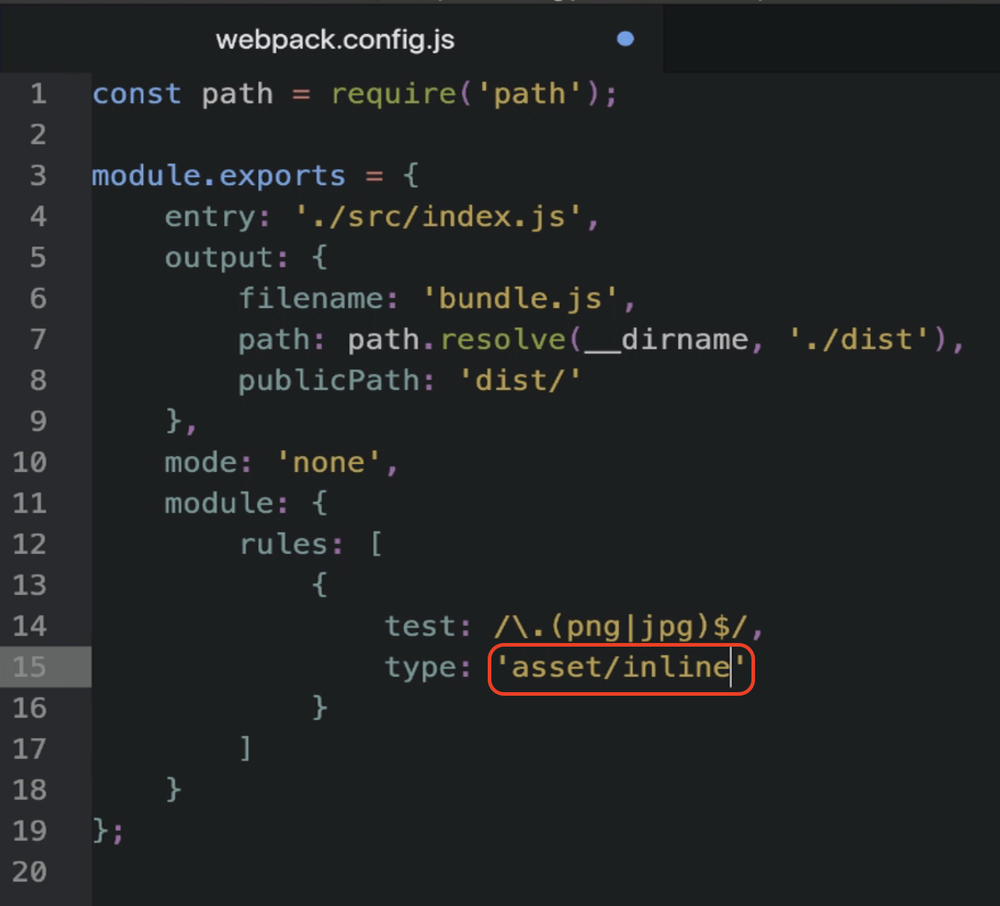

# Asset Inline Module Type

## What is Asset Inline Module Type?
- **Asset inline** inlines a file into the bundle as a **data URI**.
- This type of asset module:
  - Does **not** generate any new file in the output directory.
  - Generates a **base64 representation** of your file and bakes it directly into the JavaScript bundle.

## When to Use Asset Inline
- Ideal for importing **small asset files** like **SVGs**.
- Can be used for **large files**, but note:
  - It will **significantly increase** the size of the JavaScript bundle.

---

## Example: Importing an Image Using Asset Inline

### Steps:
1. Open the **webpack configuration file**.
2. Change the asset module type from `asset resource` to `asset inline`.



3. Run the following command 

  ```bash
   npm run build
  ```

### Observation:
- The size of the generated JavaScript bundle became **much larger** (approximately **2.5MB**).
- Inspecting the generated file shows:
  - A **base64 representation** of the Kivy image.
  - Webpack converted the image to a **base64 string** and injected it into the JavaScript bundle.

---

## Checking the Output

### In the Browser:
- The web page still shows the **same image**.
- Developer tools reveal:
  - The `src` attribute of the `` tag contains the **long base64 string** from the JavaScript bundle.

### Key Insight:
- Using **asset inline module type** can significantly increase the bundle size.
- However, it can be beneficial in specific scenarios.

---

## Comparing Asset Inline and Asset Resource

### Asset Resource:
- Generates a **separate file** for every image.
- Browser makes a **separate HTTP request** for each image.
- Suitable for **large images** like JPEGs.

### Asset Inline:
- **Inlines files** directly into the JavaScript bundle.
- Eliminates the need for **separate HTTP requests**.
- Ideal for **small SVGs** (e.g., icons).

---

## Use Case for Asset Inline

- Consider a scenario with **20 small SVGs** as icons:
  - Using `asset resource`: The browser makes **20 additional HTTP requests**.
  - Using `asset inline`: All icons are inlined into the **main JavaScript bundle**.

### Benefit:
- **Saves the cost** of making multiple HTTP requests for tiny files.
- Improves performance for pages with numerous small assets.

---

## Summary
- **Asset inline module type**:
  - Inlines assets into the JavaScript bundle as base64.
  - Best suited for **small files**, especially **SVGs**.
- Be mindful of bundle size when deciding between **asset inline** and **asset resource**.
- Optimize based on the type and size of your assets.

By understanding when to use the **asset inline module type**, you can make more informed decisions to optimize your Webpack bundles.

