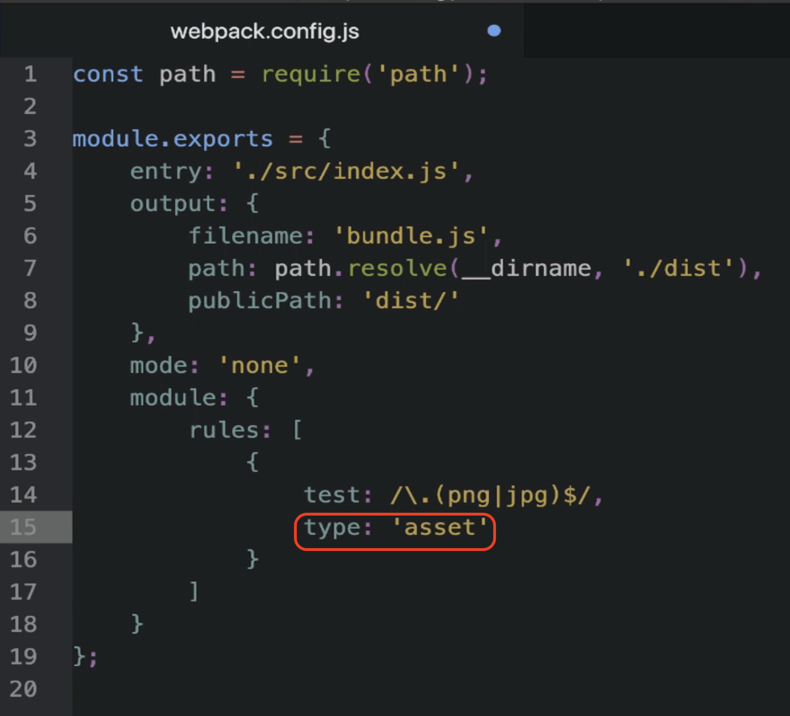
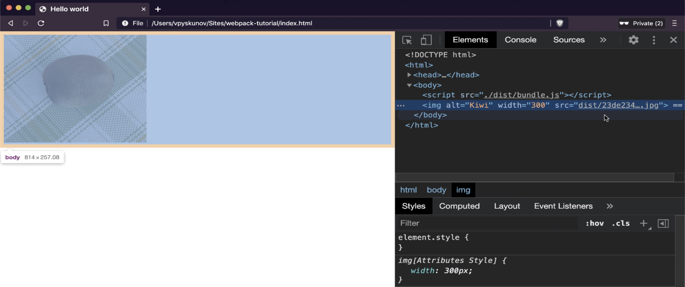

## General Asset Module Type

### What is General Asset Module Type?
- A combination of **asset resource** and **asset inline**.
- Webpack automatically decides between the two based on the file size:
  - Files **less than 8KB**: Treated as **inline assets**.
  - Files **greater than 8KB**: Treated as **resource assets**.

### Configuring General Asset Module Type
1. Open the **webpack configuration file**.
2. Change the module type from `asset inline` or `asset resource` to `asset`.



3. Run Webpack via the terminal:
   ```bash
   npm run build
   ```

### Observation:
- For large files like the Kiwi image:
  - Webpack treated it as an **asset resource**.
  - Generated a **separate file** in the `dist` directory.
  - The size of the main JavaScript bundle became much smaller.




---

## Changing the Magic Number (Threshold Size)

### Default Threshold
- By default, Webpack treats files **less than 8KB** as inline assets.

### Customizing the Threshold
1. Add the `parser` option to the Webpack configuration:
   ```javascript
   {
     test: /\.(png|jpg|svg)$/,
     type: 'asset',
     parser: {
       dataUrlCondition: {
         maxSize: 3 * 1024 // 3KB
       }
     }
   }
   ```
2. The `dataUrlCondition` property specifies the **maximum file size** for inline assets.
   - Files smaller than **3KB**: Treated as inline assets.
   - Files larger than **3KB**: Treated as resource assets.

---

## Summary
- **Asset inline module type**:
  - Inlines assets into the JavaScript bundle as base64.
  - Best suited for **small files**, especially **SVGs**.
- **General asset module type**:
  - Combines asset inline and asset resource.
  - Automatically decides based on file size.
  - Default threshold: **8KB** (customizable via `dataUrlCondition`).

By understanding when to use the **asset inline** and **general asset module types**, you can optimize your Webpack configuration for both performance and bundle size.

