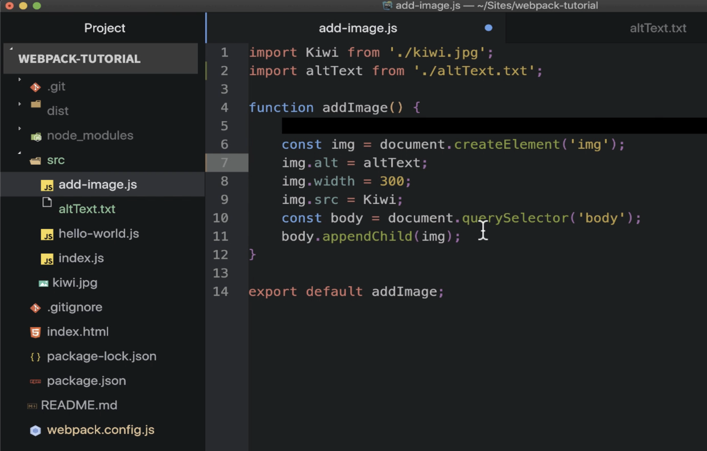
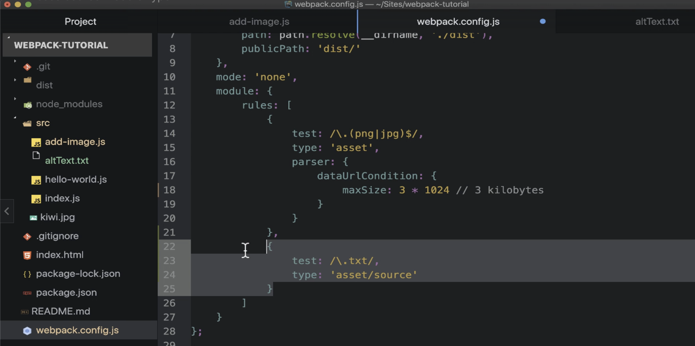
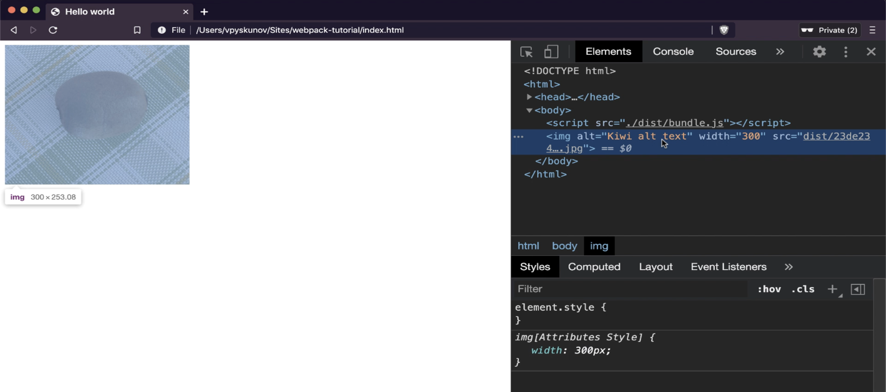

# Learning About Asset Source Module Type
---

## **Introduction to Asset Source Module Type**
- **Asset source** reads the content of a file into a JavaScript string.
- The string is directly injected into the **JavaScript bundle** without any modifications.
- Similar to **asset inline**, it does not generate a new file in the output directory.

---

## **Demonstration: Importing and Using a Text File**
1. **Creating a New File (`altText.txt`)** 
   - A tiny piece of text is placed in a separate file inside the `src` folder.
   - A small modification is made to ensure Webpack uses the exact text.

2. **Importing the File**
   - Import the file into the `add images` section.
   - Use the variable from the imported file when specifying the alternate text for the image.

---

## **Configuring Webpack for Text Files**
1. **Editing the Webpack Configuration File**
   - Locate the Webpack configuration file.
   - Currently, there is only one rule defined.
   - Add a new rule targeting **text files**.

2. **Setting Asset Source Module Type**
   - Use `asset source` as the module type for text files.
   - This configuration tells Webpack to:
     - Read the contents of the text file.
     - Provide a **JavaScript string** with the file contents.
     - Enable usage of this string as needed in the application.

---

## **Running Webpack and Verifying**
1. **Running Webpack**
   - Execute `npm run build` in the terminal.
   - Ensure no errors are encountered.

2. **Checking in the Browser**
   - Open the web page in the browser.
   - Verify that the page displays the correct content.

3. **Using Developer Tools**
   - Open the **Developer Tools**.
   - Inspect the **Document Object Model (DOM)**.
   - Confirm that:
     - Webpack successfully imported the alternate text from the external file.
     - The alternate text is applied to the image tag.

---

## **Conclusion**

> By using asset source, you can handle text file imports seamlessly in your Webpack workflow.

