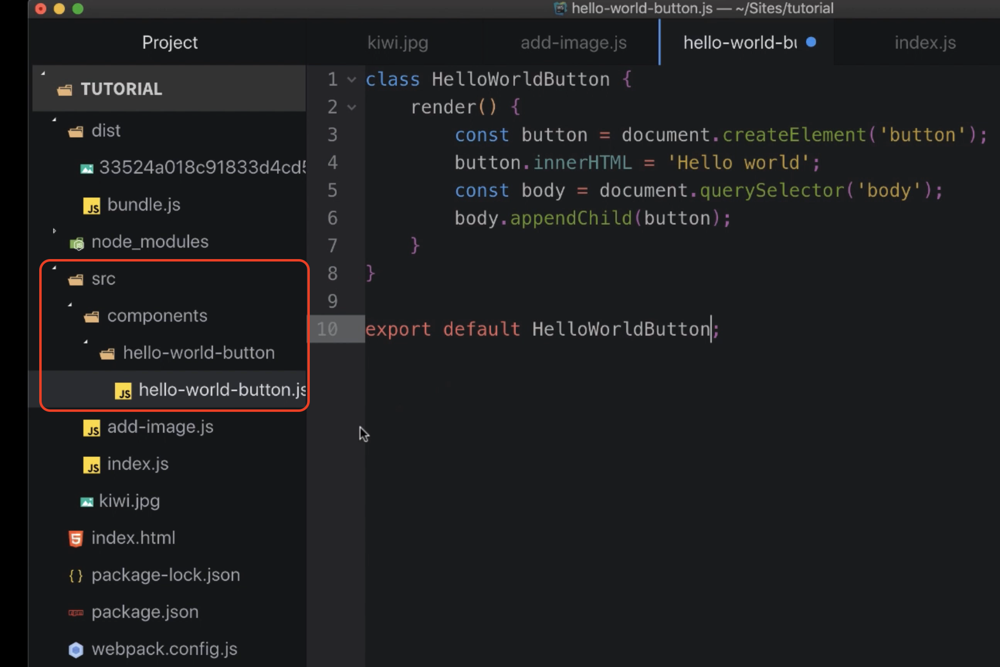
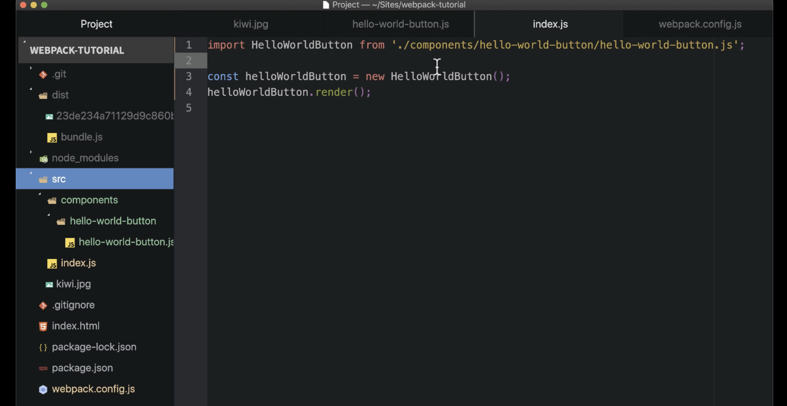
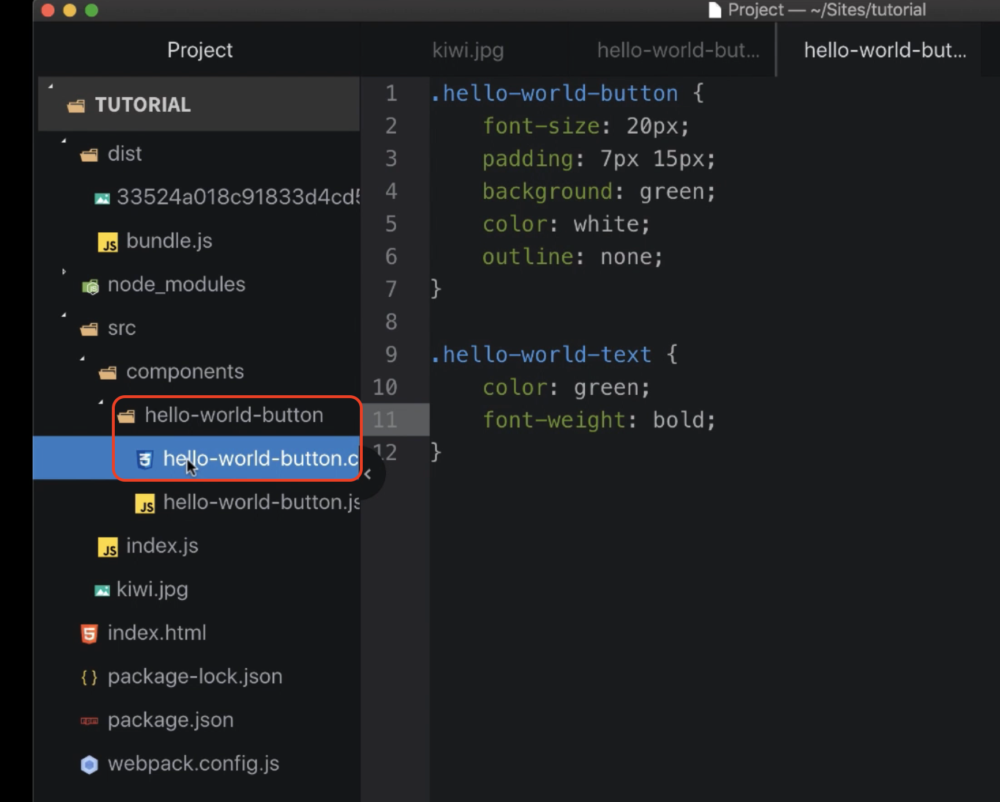
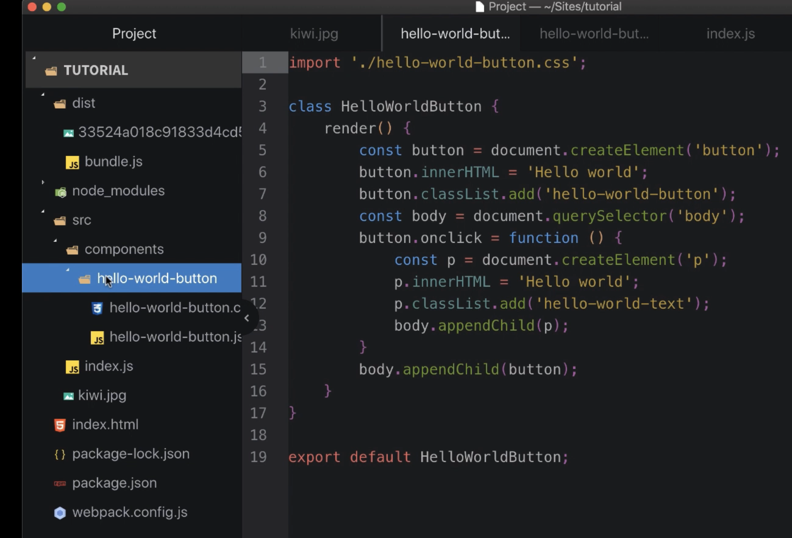
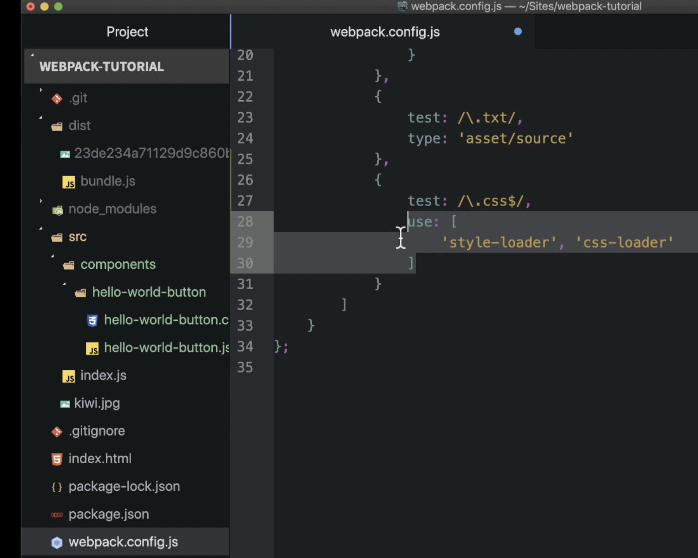

# Importing CSS into JavaScript with Webpack

One of the coolest features of Webpack is its ability to **import CSS files directly into your JavaScript** code. 

---

## **Why Import CSS into JavaScript?**
- With modern **component-based frameworks** like React or Angular:
  - Applications are separated into **isolated components**.
  - Each component has its own behavior (JavaScript) and styles (CSS).
- Keeping styles and behavior in one place:
  - Simplifies debugging and adding new features.
  - Encourages reuse of components.

---

## **Refactoring to a Component**
### Steps:
1. **Create Component Folders**:
   - Create a folder called `components`.
   - Inside, create another folder named `hello-world-button`.

2. **Move and Rename Files**:
   - Move `hello-world.js` into the new folder.
   - Rename it to `hello-world-button.js`.

3. **Create a Component Class**:
   - Remove the `helloWorld` function.
   - Create a class `HelloWorldButton` to render a button.
   - Add a `render` method to:
     - Create a button DOM element.
     - Append it to the `body` DOM element.

4. **Export the Component**:
   - Export the class instead of the original function.

5. **Update `index.js`**:
   - Import the new component from the `components/hello-world-button` folder.
   - Instantiate the component and invoke the `render` method.

6. **Run Webpack**:
   - Remove the `addImage` function and related imports.
   - Run Webpack in the terminal.
   - Open the browser and verify: A button labeled **Hello World!** is displayed.

---

## **Adding Functionality to the Button**
### Steps:
1. **Add an `onClick` Property**:
   - Modify the button to:
     - Create a paragraph element with text when clicked.

2. **Create a CSS File**:
   - Place the CSS file inside the same folder as the JavaScript file.
   - Add simple styles for:
     - The button (e.g., font size, padding, colors).
     - The paragraph (e.g., text appearance).

3. **Import CSS into the Component**:
   - Import the CSS file inside the JavaScript file.

### Why This Structure?
- Mimics modern frontend frameworks like React/Angular.
- Organizes code by component with:
  - **JavaScript file** for behavior.
  - **CSS file** for styles.

---

## **Configuring Webpack for CSS**
### Steps:
1. **Update Webpack Configuration**:
   - Add a new rule targeting CSS files.

2. **Use `use` Property**:
   - Specify loaders:
     - **CSS Loader**: Reads the CSS file and returns its contents.
     - **Style Loader**: Injects CSS into the page using `<style>` tags.

3. **Install Loaders**:
   - Unlike Asset Modules (built into Webpack), loaders must be installed explicitly:
     - Run `npm install css-loader style-loader`.

4. **Bundle CSS with JavaScript**:
   - CSS is bundled with JavaScript into a single file (e.g., `bundle.js`).

---

## **Testing the Setup**
### Steps:
1. **Run Webpack**:
   - Execute Webpack and verify there are no errors.

2. **Check in the Browser**:
   - Refresh the page.
   - Verify:
     - Button size and color are applied.
     - Clicking the button creates green text below it.

3. **Inspect with Developer Tools**:
   - Open the **head tag** in the DOM.
   - Confirm a `<style>` tag containing the CSS is present.

---

## **Conclusion**
- Successfully imported CSS into JavaScript.
- Learned to use and combine multiple loaders in a Webpack rule.
- Verified the setup works as expected.

