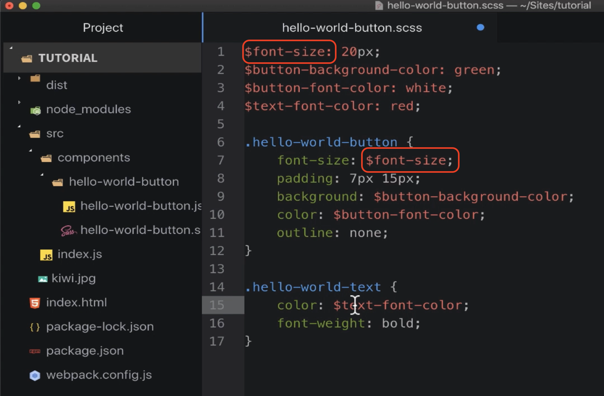

# Importing and Using SASS in Webpack

---

## **Switching from CSS to SASS**

### Steps:
1. **Change File Extension**:
   - Rename the CSS file with a `.scss` extension.

2. **Introduce Variables**:
   - Define variables for font sizes and colors in the SASS file.
   - Example:
     ```scss
     $font-size: 20px;
     $text-font-color: red;

     body {
         font-size: $font-size;
         color: $text-color;
     }
     ```



3. **Update Import Statement**:
   - Modify the import statement in the JavaScript file to point to the `.scss` file.

---

## **Configuring Webpack for SASS**

### Steps:
1. **Copy and Modify the CSS Rule**:
   - Duplicate the existing CSS rule in the Webpack configuration file.
   - Modify the rule to target `.scss` files instead of `.css` files.

2. **Add SASS Loader**:
   - Include the **SASS loader** at the end of the loader chain.


### Loader Processing Order:
- Webpack processes loaders from **right to left**. For `.scss` files:
  1. **SASS Loader**:
     - Converts SASS/SCSS into standard CSS.
  2. **CSS Loader**:
     - Transforms the CSS into a JavaScript representation.
  3. **Style Loader**:
     - Injects the CSS into `<style>` tags in the HTML.

---

## **Installing SASS Loader**

### Required Packages:
1. **SASS Loader**:
   - Translates SASS/SCSS to CSS.
2. **Dart SASS Library**:
   - Primary implementation of SASS.
   - Advantages:
     - **New Features**: Receives updates faster than other implementations.
     - **Performance**: Compiles SCSS to CSS at incredible speed.
     - **Integration**: Pure JavaScript implementation simplifies modern web workflows.

### Installation Command:
```bash
npm install sass-loader sass
```

---

## **Running Webpack and Verifying**
1. **Run Webpack**:
   - Execute Webpack to process the updated configuration.

2. **Test in the Browser**:
   - Refresh the page.
   - Verify that:
     - The updated styles (e.g., red text) are applied correctly.
     - The page still functions as expected.

3. **Example Verification**:
   - On clicking buttons, observe the red text appearing as per the SASS-defined styles.

---

## **Conclusion**
- Successfully integrated **SASS** into the project using Webpack.
- Key Learnings:
  - How to use multiple loaders in a single Webpack rule.
  - The role of **SASS Loader**, **CSS Loader**, and **Style Loader** in the processing chain.

