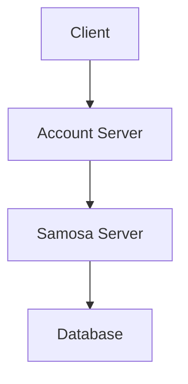

# Client-Server Architecture

[Watch on Youtube](https://www.youtube.com/watch?v=jWGSVN_4atk)

---

### **Introduction:**
  - Topic: Client-server architecture.
  - Discussion points:
    - What is a client?
    - What is a server?
    - Difference between front-end and back-end.
    - Role of databases and web servers.
  - Analogy of a samosa stall to explain architectural concepts.

### **One-Tier Architecture:**
  - Example: A samosa stall.
  - All tasks happen in one place:
    - Making samosas.
    - Displaying samosas.
    - Selling and accounting.
  - **Challenges:** Limited scalability and inability to attract premium clients.

### **Two-Tier Architecture:**
  - Upgraded to a small restaurant.
  - Process:
    - Customers sit and place orders.
    - Waiter takes the order and delivers it to the customer.
  - **Technical Terms:**
    - Customer makes a **request**.
    - Waiter delivers a **response**.
    - Waiter acts as the **API** connecting the client and server.

### **Three-Tier Architecture:**
  - Introduces a separation of concerns:
    - Dedicated **account server** for handling payments.
    - Dedicated **samosa server** for preparing samosas.
  - Process:
    - Customer pays first, order is processed, and delivery happens.
  - **Flow:**
    - Client -> Account Server -> Samosa Server -> Account Server -> Client.
  - **Key Point:** APIs are not limited to client-server communication but can also facilitate server-to-server communication.

### **Adding a Database Layer:**
  - Introduced a **factory** for making and storing samosas.
  - In technical terms:
    - **Database:** Stores data (samosas in the analogy).
    - Server retrieves data from the database to fulfill client requests.
  - **Pictorial Representation:**
    - Database represented as a cylinder.
    - Servers and clients as layers in the architecture.



### **Client Types:**
  - Web application (browser-based clients).
  - Mobile applications (iOS, Android, etc.).

### **N-Tier Architecture:**
  - Scaled architecture with multiple specialized servers:
    - Example: Cutlery server for napkins and utensils.
  - Highlights:
    - Scalable and modular design.
    - Supports adding more layers as needed.

### **Front-End vs Back-End:**
  - **Front-End:**
    - User-facing components.
    - Examples: Ordering samosas, seating area.
  - **Back-End:**
    - Behind-the-scenes operations.
    - Examples: Payment processing, samosa preparation, database operations.

```markdown
| Component     | Description                              |
|---------------|------------------------------------------|
| Front-End     | User interface, client interactions.     |
| Back-End      | Business logic, data processing, storage |
```

### **Conclusion:**
  - Client-server architecture simplifies application design.
  - Clear distinction between front-end and back-end.
  - Encourages modular and scalable development.

---

